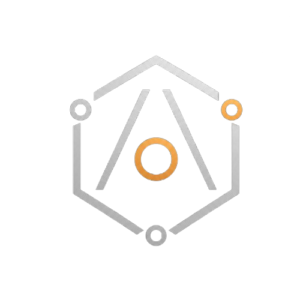
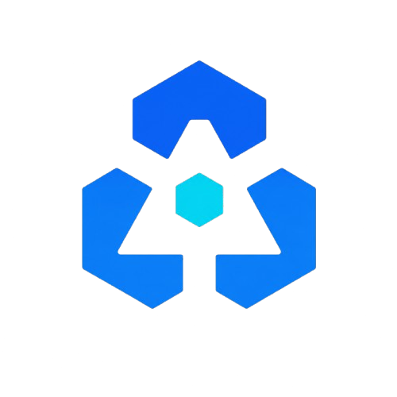

# Douglas Alkimim

**Technical Lead and Data Scientist building open-source developer tools and solutions for small and medium-sized businesses in Brazil.**

I build software at the intersection of architecture, data science, AI agents, and applied mathematics. My focus is turning technical and operational complexity into modular, maintainable, and useful systems.

  
  &nbsp;
  &nbsp;
  
  &nbsp;
  &nbsp;
  
  &nbsp;
  &nbsp;
  
  &nbsp;
  &nbsp;
  
  &nbsp;
  &nbsp;
  

## Open source work

### AlkimimOS

  
    An open-source ecosystem for organizing and extending AI coding agents. It combines reusable skills, governance rules, scoped project context, configurable workspaces, and modular capabilities into a coherent operational model.
    
  

 

---

### PyAtomic

  
    <b>Architecture Toolkit for Organized, Modular, and Isolated Code.</b> A Python library for structuring codebases around explicit responsibilities, modular boundaries, and reusable architectural building blocks.
    
  

 

## What I work on

- **Software architecture and backend systems** — modular design, clear boundaries, APIs, databases, and automation.
- **Data science and intelligent systems** — LLM applications, machine learning, and time-series modeling.
- **Applied mathematics** — algorithms, complexity, numerical methods, dynamical systems, and control.
- **Developer tooling and AI agents** — reusable skills, governance, context management, and structured coding workflows.

## Background

My professional background spans technical leadership and data science, with hands-on experience in software architecture, backend development, databases, automation, and AI-enabled systems. I also develop open-source tools and software products through **Alkimim Cloud & Inovação LTDA**.

## Work with me

I am open to software development contracts, project-based work, technical consulting, and private lessons in mathematics and programming.

Explore the projects above or learn more about my work at [douglas.alkimim.com](https://douglas.alkimim.com) and [Alkimim](https://www.alkimim.com). For professional inquiries, contact me by [email](mailto:douglas@alkimim.com) or through [LinkedIn](https://www.linkedin.com/in/douglas-alkimim/).

<!-- PROFILE_LAST_REVIEWED: 2026-08-02 -->